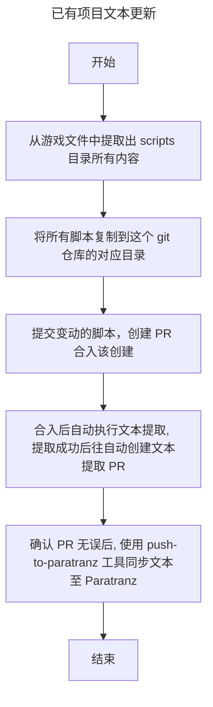
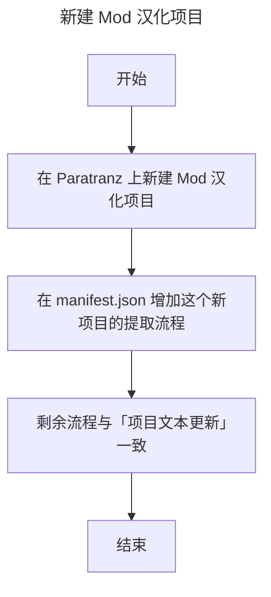

# Battle-Brothers-CN-Source

这是“Battle Brothers”（战场兄弟）文本提取与汉化管理仓库。项目目标是把从游戏文件中提取文本的流程规范化、自动化并方便维护，使多人协作时的文本更新、PR 和同步到 Paratranz 的流程更清晰、可复现。

> 2024年就已经做了文本提取器，但是也没有人会用，这个项目将文本提取流程化管理，希望能方便维护文本吧。
> TODO: 
> 1. Battle-Brothers-CN 项目支持存放 Mods 和同步 Mods 项目的文本
> 2. 翻译器支持翻译 Mods

## 快速上手（简要）

1. 将游戏/Mod 的 scripts 目录复制到本仓库对应位置并提交变更。  
2. 创建 PR：合入后触发 CI，会自动执行文本提取并创建文本提取 PR。  
3. 校对文本提取 PR，确认无误后使用 push-to-paratranz 工具将文本同步到 Paratranz。  

如需详细操作说明或新增提取规则，请查看 docs/（若存在）或在仓库中打开 issue 讨论。

---

欢迎贡献与改进：请按仓库约定提交 PR 并在变更中添加必要说明。

## 管理流程概要

### 1. 已有项目文本更新

### 2. 新建 Mod 汉化项目

## 项目结构（简介）
下面给出仓库中常见目录和文件的说明，便于快速定位与维护。

- data/scripts/  
  存放从原版游戏中提取的原始脚本文件。这是文本提取的输入源，新增 Mod 另外按 Mod 名称新建目录。

- manifests/ 或 manifest.json  
  定义需要提取或同步的 Mod/项目清单与提取规则（例如哪些目录需要同步到 Paratranz）。用于自动化流水线识别要处理的项目。
