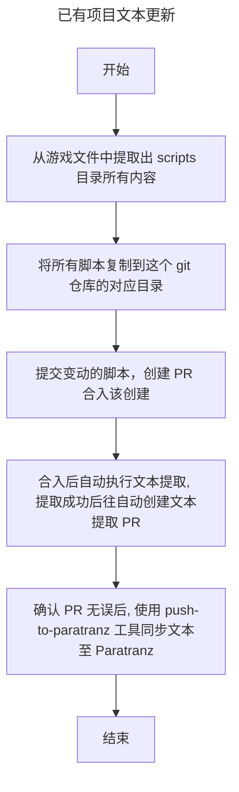
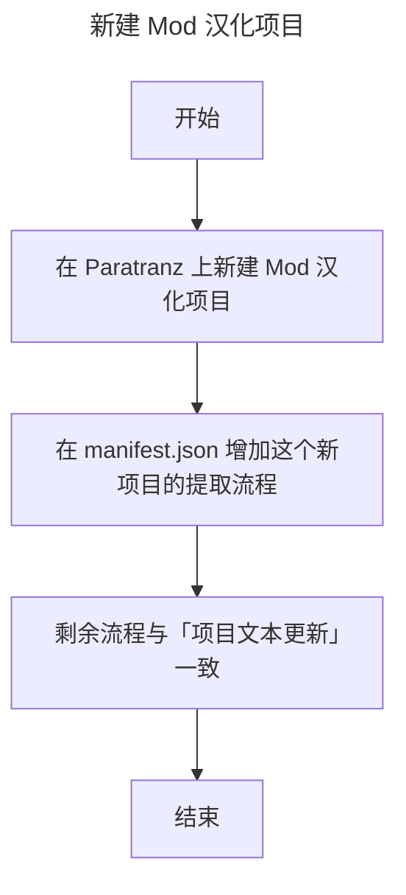

# Battle-Brothers-CN-Source

这是“Battle Brothers”（战场兄弟）文本提取与汉化管理仓库。项目目标是把从游戏文件中提取文本的流程规范化、自动化并方便维护，使多人协作时的文本更新、PR 和同步到 Paratranz 的流程更清晰、可复现。

> 2024年就已经做了文本提取器，但是也没有人会用，这个项目将文本提取流程化管理，希望能方便维护文本吧。

## 快速上手（简要）

1. 将游戏脚本复制到 `data/`，或将 Mod 源码放入 `mods/<mod-id>/` 后提交变更。  
2. 创建 PR：合入后触发 CI，会自动执行文本提取并创建文本提取 PR。  
3. 校对文本提取 PR，确认无误后使用 push-to-paratranz 工具将文本同步到 Paratranz。  

如需详细操作说明或新增提取规则，请查看 [docs/mods.md](docs/mods.md) 或在仓库中打开 issue 讨论。

---

欢迎贡献与改进：请按仓库约定提交 PR 并在变更中添加必要说明。


## 管理流程概要

### 1. 已有项目文本更新



### 2. 新建 Mod 汉化项目



## 项目结构（简介）
下面给出仓库中常见目录和文件的说明，便于快速定位与维护。

- data/  
  存放从原版游戏中提取的原始脚本文件。这是原版文本提取的输入源。

- mods/  
  存放 Mod 源码或固定到上游仓库的 submodule。每个 Mod 使用独立目录，例如 `mods/reforged/`。

- tools/  
  存放仓库维护脚本，例如 `tools/extract_text.py`。

- manifests/ 或 manifest.json  
  定义需要提取或同步的 Mod/项目清单与提取规则（例如哪些目录需要同步到 Paratranz）。用于自动化流水线识别要处理的项目。

## 已接入 Mod

### Battle Brothers - Reforged

- Mod ID: `reforged`
- 来源: https://www.nexusmods.com/battlebrothers/mods/765
- 上游源码: https://github.com/Battle-Modders/mod-reforged
- 版本: `0.9.2`
- 本仓库路径: `mods/reforged`
- 固定 tag/commit: `0.9.2` / `7b8ca29e4d171e027064cdea9d391c976f9d0124`
- ParaTranz project_id: `19677`
- 提取输出: `zh_CN.UTF-8/json/mods/reforged`

首次克隆后执行：

```bash
git submodule update --init --recursive
```

本地执行文本提取：

```bash
python tools/extract_text.py /path/to/Battle-Brothers-CN
```

只提取某一个 `manifest.json` job：

```bash
python tools/extract_text.py /path/to/Battle-Brothers-CN --job reforged
```

如果本机使用已安装提取器的 pyenv shim，可执行：

```bash
/Users/netease-game/.pyenv/shims/python tools/extract_text.py /path/to/Battle-Brothers-CN
```

翻译器需要使用已支持 Mods 的版本，例如 [bb-translator v2.0.0](https://github.com/shabbywu/bb-translator/releases/tag/v2.0.0) 或更新版本。
